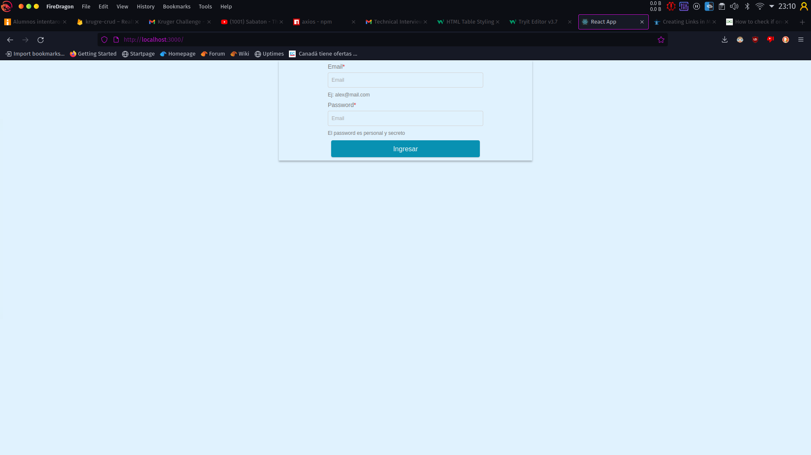

# Kruger Crud 

Esta web app, tiene la siguiente funcionalidad divida por rol:
1. admin:
*   agregar empleados.
*   dar de alta a empleados (se crea un usuario para el empleado).
*   filtrar datos de empleados.

2. User/Empleado
*   ver y actualizar sus datos.

## Dependencias principales.
* React 18.1.0.
* Native-base 3.4.0.
* typescript 4.7.3
* axios 0.27.2
* formik 2.2.9.
* firebase 9.8.2.

## Login 
mediante el uso del modulo de Auth de firebase.

el usuario admin tiene las sig credenciales:
* email: admin@kruger.com
* password: admin123.
## Base de datos:
se utilizo la base de datos en tiempo real, se utilizaron las funciones propias de firebase para obtener los datos de tiempo real y la integracion de una api desplegada en [firebase cloud functions](https://github.com/alexc957/kruger-backend).

La estructura de la base es la siguiente:
* users: contiene todos los usuarios que pueden ingresar al sistema.
* employeees: contiene todos los empleados con los campos descritos en la formulacion del problema. 

## Pasos para ejecutar el proyectoL
1. Clonar el proyecto con git.
2. instalar depedencias: npm i.
3. enjoy. 

## TODO: Trabajo por mejorar
* integrar React Router.
* reestructurar el backend.
* mejorar los filtros de la tabla.
* estilos.
nota: se puede visitar la app en el siguiente [enlace](https://krugre-crud.web.app)
## Capturas de pantalla 

